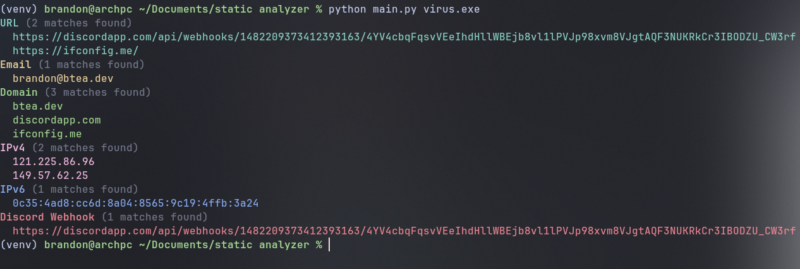
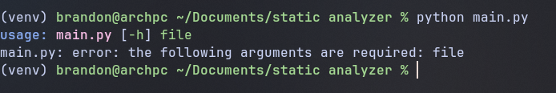

# IOC Extractor

Extract Indicators of Compromise (IOCs) from files using regex patterns.

## Usage
```bash
python main.py /path/to/file
```

## Supported IOCs

- URLs
- Email addresses
- IP addresses (IPv4 & IPv6)
- Domain names
- Discord webhooks


 